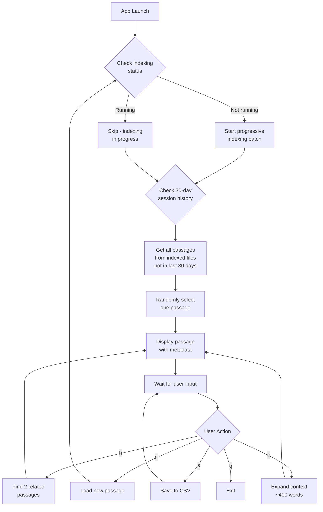

# Multi-Format Passage Explorer MVP - Specification Document

## 1. Overview

### 1.1 Purpose

A terminal-based application that helps writers discover and explore meaningful passages from a collection of documents (PDFs, HTML files, plain text, Markdown) stored in nested folders. The MVP focuses on serendipitous discovery, horizontal reading across documents, and building a curated collection of passages for essay writing.

### 1.2 Core Principles

- **Serendipity**: Each session reveals new, previously unseen passages
- **Cohesion**: Passages are meaningful units, not arbitrary chunks
- **Exploration**: Multiple expansion modes enable deep and wide reading
- **Writer-focused**: Saved passages are exportable for essay composition

## 2. Core Features

### 2.1 Passage Display

- **Initial Passage**: On app launch, display a unique passage (not shown in past 30 days)
- **Length**: Maximum 420 characters
- **Metadata Display**:
  - Internal document title (from PDF metadata/content)
  - Page number or chapter
  - Filename
  - Author (if available in PDF metadata)
  - Fallback: filename + page if metadata unavailable

### 2.2 User Actions

1. **New Passage** (`n`): Load a new unique passage
2. **Expand Horizontally** (`h`): Show 2 semantically related passages from other documents
3. **Expand Context** (`c`): Show ~400 words of context (semantic chunking around passage)
4. **Save Passage** (`s`): Save current passage to CSV collection
5. **Index Next Batch** (`i`): Manually trigger indexing of the next batch of files (if any pending)
6. **Help** (`?`): Show help/usage information (always available)
7. **Quit** (`q` or `Ctrl+C`): Exit application gracefully

**Keyboard Shortcuts**:
- All actions are single-key for efficiency
- Case-insensitive (N or n both work)
- `Ctrl+C` always exits (graceful shutdown)
- Press `Enter` from expansion views (horizontal or context) to return to the main passage view (the same passage remains current)
- **Note**: `h` is for horizontal expansion, `?` is for help (avoids conflict)

### 2.3 Passage Selection Algorithm

- **Hybrid Approach**: Structural boundaries (paragraphs/sentences) with semantic scoring
- Extract candidate passages at paragraph boundaries
- Score candidates for semantic coherence using embeddings
- Select passages that are:
  - Complete thoughts (not mid-sentence)
  - Semantically cohesive (high internal similarity)
  - Between 100-420 characters

### 2.4 Related Passage Discovery

- **Semantic Similarity**: Use embedding-based similarity to find related passages
- When expanding horizontally, find 2 passages from different documents that:
  - Have high semantic similarity to current passage
  - Are from different source files (encourage cross-document reading)
  - Have not been shown in current session
  - Can be from any supported format (PDF, HTML, TXT, MD)

### 2.5 Context Expansion

- **Semantic Chunking**: Expand to ~400 words by:
  - Starting from original passage boundaries
  - Extending to nearest paragraph/section boundaries
  - Aiming for ~400 words total (flexible ±50 words)
  - Preserving semantic coherence

## 3. Technical Architecture

### 3.1 Technology Stack

- **Language**: Python 3.9+
- **PDF Processing**: `pypdf` or `pdfplumber` for PDF text extraction
- **HTML Processing**: `beautifulsoup4` and `html2text` for HTML parsing and conversion
- **Text Processing**: Built-in file reading for `.txt` and `.md` files
- **Embeddings**: `sentence-transformers` (all-MiniLM-L6-v2 for speed) or OpenAI embeddings API
- **Terminal UI**: `rich` library for formatted terminal output
- **CLI Parsing**: `argparse` (standard library) or `click` (optional, for advanced features)
- **Logging**: `logging` (standard library) with file rotation
- **Data Storage**: 
  - SQLite for session history and passage index
  - CSV for saved passages export
- **Metadata Extraction**: 
  - PDF: `PyPDF2` or `pdfplumber` for PDF metadata
  - HTML: Extract from `<title>`, `<meta>` tags, or filename
  - Text/Markdown: Extract from filename or first heading

### 3.2 Data Models

#### 3.2.1 Passage

```python
{
    "id": "uuid",
    "text": "passage content (max 280 chars)",
    "source_file": "/absolute/path/to/file.pdf",  # ALWAYS absolute path
    "file_type": "pdf",  # "pdf", "html", "txt", "md"
    "page_number": 42,  # For PDFs; line_number for text files
    "chapter": "Chapter 3" (optional),
    "section": "Section Name" (optional),  # For HTML/text files
    "document_title": "Title from document metadata",
    "author": "Author Name" (optional),
    "start_char": 1234,  # Character position in document
    "end_char": 1514,
    "embedding": [0.123, ...],  # Vector embedding
    "extracted_at": "2026-01-15T10:30:00Z"
}
```

**Critical**: `source_file` must always be stored as an absolute path. This ensures:
- Index survives library path changes in config.yaml
- Files remain accessible even if user changes library_path
- No path resolution issues when accessing indexed files

#### 3.2.2 Session History

```python
{
    "session_date": "2026-01-15",
    "passage_ids": ["uuid1", "uuid2", ...],
    "created_at": "2026-01-15T10:00:00Z"
}
```

#### 3.2.3 Saved Passage

```python
{
    "saved_at": "2026-01-15T10:45:00Z",
    "passage_id": "uuid",
    "notes": "optional user notes" (future enhancement)
}
```

#### 3.2.4 Indexing Status

```python
{
    "file_path": "/absolute/path/to/file.pdf",  # ALWAYS absolute path
    "status": "pending",  # "pending", "indexing", "completed", "failed"
    "indexed_at": "2026-01-15T10:30:00Z" (optional),
    "error_message": null (optional),
    "created_at": "2026-01-15T10:00:00Z"
}
```

**Critical**: `file_path` must always be stored as an absolute path for the same reasons as `source_file` in Passage model.

### 3.3 File Structure

```
npcapp/
├── Library/                    # User's document source directory (optional)
│   └── [nested folders with PDFs, HTML, TXT, MD files]
├── Library-Sample/            # Sample test documents (default for MVP)
│   ├── txt/
│   ├── html/
│   ├── md/
│   └── pdf/
├── config.yaml                # User configuration file (created on first run)
│                              # Alternative: ~/.config/passage-explorer/config.yaml (future)
│   ├── txt/
│   ├── html/
│   ├── md/
│   └── pdf/
├── data/                       # Application data
│   ├── passages.db            # SQLite database
│   └── saved_passages.csv     # Exported saved passages
├── index/                      # Cached document processing
│   └── [cached passage data]
├── src/
│   ├── __init__.py
│   ├── main.py                # Entry point & CLI argument parsing
│   ├── cli.py                 # Command-line interface & argument handling
│   ├── document_processor.py  # Multi-format document extraction
│   │   ├── pdf_handler.py     # PDF-specific processing
│   │   ├── html_handler.py    # HTML-specific processing
│   │   └── text_handler.py    # TXT/MD processing
│   ├── passage_extractor.py  # Passage identification
│   ├── passage_store.py      # Database operations
│   ├── similarity.py         # Semantic similarity
│   ├── ui.py                  # Terminal interface
│   ├── logger.py              # Logging configuration
│   └── config.py              # Configuration
├── requirements.txt
├── README.md                  # User documentation & installation
├── CHANGELOG.md               # Version history
└── SPEC.md                     # This document
```

## 4. Implementation Details

### 4.1 Multi-Format Document Processing Pipeline

#### 4.1.1 Supported File Types

- **PDF** (`.pdf`): Extract text with page boundaries, metadata from PDF structure
- **HTML** (`.html`, `.htm`): Parse HTML, extract text content, preserve structure
- **Plain Text** (`.txt`): Read directly, use line numbers for location
- **Markdown** (`.md`, `.markdown`): Parse markdown, extract text, preserve heading structure

#### 4.1.2 Document Processor Architecture

Use a strategy pattern with format-specific handlers:

```python
class DocumentProcessor:
    def __init__(self):
        self.handlers = {
            '.pdf': PDFHandler(),
            '.html': HTMLHandler(),
            '.htm': HTMLHandler(),
            '.txt': TextHandler(),
            '.md': TextHandler(),
            '.markdown': TextHandler()
        }
    
    def process(self, file_path):
        ext = Path(file_path).suffix.lower()
        handler = self.handlers.get(ext)
        if handler:
            return handler.extract(file_path)
        return None
```

#### 4.1.3 Format-Specific Processing

**PDF Handler:**

- Extract text with page boundaries using `pdfplumber`
- Extract metadata (title, author) from PDF metadata
- Use page numbers for location reference
- **Timeout Protection**: PDF files that take more than 5 minutes to index are automatically abandoned
  - Timeout is checked before processing each page
  - If timeout is exceeded, the file is marked as "failed" with a timeout error message
  - App continues to the next file without blocking
  - Prevents very large or problematic PDFs from blocking the indexing process

**HTML Handler:**

- Parse HTML with `BeautifulSoup4`
- Extract text content, strip HTML tags
- Extract title from `<title>` tag or `<h1>` heading
- Extract author from `<meta name="author">` if available
- Use section headings for structure
- Convert HTML entities to text

**Text Handler (TXT/MD):**

- Read file as UTF-8 text
- For Markdown: parse headings to identify sections
- Extract title from first heading or filename
- Use line numbers for location reference
- Preserve paragraph boundaries

#### 4.1.4 Progressive Indexing Strategy

**Initial Batch (First Run):**

1. On first app launch, scan configured library directory (default: `Library-Sample/`) recursively for all supported file types
2. Index only a small batch (default: 5-10 files) to enable immediate use
3. Process batch:

   - Detect file type by extension
   - Route to appropriate handler
   - Extract text with location markers (page/line/section)
   - Extract metadata (title, author, structure)
   - Identify paragraph boundaries
   - Generate candidate passages
   - Score and filter passages
   - Generate embeddings
   - Store in database with `file_type` field

4. Mark files as indexed in database
5. App is immediately usable with this initial batch

**Progressive Indexing (Subsequent Runs):**

- Each time the app launches or user pulls a new passage:
  - Check if indexing is already running (via lock file or database flag)
  - If not running, start incremental indexing:
    - Process next batch of unindexed files (default: 3-5 files per batch)
    - Run in background thread (non-blocking)
    - Update database as files complete
  - If indexing is running, skip (don't start duplicate process)
- Indexing continues progressively until all files are indexed
- User can use app with currently indexed files at any time

**Indexing State Tracking:**

- Database table: `indexing_status`
  - `file_path`: Path to document
  - `status`: "pending", "indexing", "completed", "failed"
  - `indexed_at`: Timestamp when completed
  - `error_message`: If failed
- Lock mechanism: File-based or database flag to prevent concurrent indexing

#### 4.1.5 On-Demand Processing

- If user requests a passage from an unindexed document:
  - Process that specific document immediately (blocking, but fast for single file)
  - Show progress indicator during processing
  - Display file type being processed
  - Add to database and make available immediately
- This ensures user can access any document even if not yet in progressive batch

### 4.2 Passage Selection Flow



### 4.3 Session Tracking

- **Daily Sessions**: Each calendar day = one session
- Track all passage IDs shown per day
- On app launch, exclude passages shown in any of the last 30 days
- Store in SQLite with date-based queries

### 4.4 Terminal UI Design

#### 4.4.1 Layout

```
┌─────────────────────────────────────────────────────────┐
│ Passage Explorer                                        │
├─────────────────────────────────────────────────────────┤
│                                                         │
│  [Passage Text - max 280 chars]                        │
│                                                         │
│  ────────────────────────────────────────────────────  │
│                                                         │
│  Source: Document Title                                │
│  Location: Page 42 (or Line 123 / Section: Intro)     │
│  File: filename.pdf                                    │
│  Type: PDF                                             │
│  Author: Author Name                                   │
│                                                         │
├─────────────────────────────────────────────────────────┤
│ Actions: [n]ew  [h]orizontal  [c]ontext  [s]ave  [?]help  [q]uit│
└─────────────────────────────────────────────────────────┘
```

#### 4.4.2 Expansion Views

- **Horizontal Expansion**: Display 3 passages side-by-side (original + 2 related)
- **Context Expansion**: Show original passage highlighted within expanded context
- Use `rich` library for syntax highlighting and formatting
- Press `Enter` to return to the main passage view (the original passage remains current; a new passage is only shown after pressing `n`)

#### 4.4.3 Help System

- **In-App Help**: Press `?` or `h` (when not in expansion) to show:
  - Available keyboard shortcuts
  - Action descriptions
  - Configuration file location
  - Library path information
- **Command-Line Help**: `python -m src.main --help` shows:
  - Available command-line arguments
  - Usage examples
  - Configuration options

#### 4.4.4 Status Messages & Feedback

- **Progress Indicators**: Show during indexing, embedding generation, file processing
- **Status Bar**: Bottom of screen shows current operation
- **Error Messages**: Clear, actionable error messages with suggestions
- **Success Feedback**: Brief confirmation for actions (e.g., "Passage saved")
- **Loading States**: Show spinner or progress bar for operations >1 second

### 4.5 Saved Passages Export

- **Format**: CSV with columns:
  - `saved_at`, `text`, `document_title`, `location` (page/line/section), `filename`, `file_type`, `author`, `chapter`
- **Location**: `data/saved_passages.csv`
- **Append mode**: New saves append to existing file
- **Encoding**: UTF-8 with BOM for Excel compatibility
- **Location Format**: 
  - PDF: "Page 42"
  - HTML: "Section: Introduction" or "Line 123"
  - Text/MD: "Line 123" or "Section: Chapter 1"

## 5. Command-Line Interface

### 5.1 Command-Line Arguments

**Basic Usage**:
```bash
python -m src.main                    # Launch interactive mode (default)
python -m src.main --help             # Show help message
python -m src.main --version         # Show version information
python -m src.main --config PATH     # Specify config file path
python -m src.main --library PATH     # Override library path (temporary)
python -m src.main --verbose         # Enable verbose logging
python -m src.main --quiet           # Suppress non-essential output
```

**Arguments**:
- `--help`, `-h`: Display help message and exit
- `--version`, `-v`: Display version number and exit
- `--config PATH`, `-c PATH`: Use custom config file (default: `./config.yaml`)
- `--library PATH`, `-l PATH`: Override library_path from config (temporary, doesn't save)
- `--verbose`: Enable debug-level logging
- `--quiet`, `-q`: Only show errors and essential messages
- `--reset-sessions`: Clear session history (useful for testing)

**Exit Codes**:
- `0`: Success
- `1`: General error (invalid config, missing dependencies)
- `2`: Library path error (not found, not readable)
- `3`: Database error
- `4`: User interrupt (Ctrl+C)

### 5.2 Signal Handling

- **SIGINT (Ctrl+C)**: Graceful shutdown
  - Wait for current operation to complete (max 5 seconds)
  - Save current state
  - Close database connections
  - Exit cleanly
- **SIGTERM**: Same as SIGINT
- **SIGHUP**: Reload configuration (future enhancement)

### 5.3 Logging System

**Log Levels**:
- `DEBUG`: Detailed information (only with --verbose)
- `INFO`: General information (default)
- `WARNING`: Warning messages (non-fatal issues)
- `ERROR`: Error messages (operations failed)
- `CRITICAL`: Critical errors (app may not function)

**Log Output**:
- Console: INFO and above (configurable)
- Log File: `data/app.log` (all levels, rotates daily)
- Format: `[TIMESTAMP] [LEVEL] [MODULE] Message`

**Logging Configuration**:
- Controlled by `--verbose` and `--quiet` flags
- Can be configured in `config.yaml` (future enhancement)

## 6. Configuration

### 6.1 Default Settings

- **Library Path**: `./Library-Sample` (default for MVP testing, configurable)
- **Passage Max Length**: 420 characters
- **Context Expansion**: ~400 words
- **Session History**: 30 days
- **Embedding Model**: `all-MiniLM-L6-v2` (local) or configurable API
- **Initial Indexing Batch Size**: 8 files (configurable)
- **Progressive Indexing Batch Size**: 4 files per batch (configurable)

### 6.2 Configuration Management

**Configuration File Location**: 
- **MVP**: `config.yaml` in project root (created on first run if not exists)
- **Future**: `~/.config/passage-explorer/config.yaml` (standard XDG location)
- **Priority**: Command-line `--config` > Project root > XDG location

**Basic User-Configurable Parameters**:

```yaml
# Library Configuration
library_path: "./Library-Sample"  # Path to document library (relative or absolute)
library_path_absolute: false      # If true, library_path is treated as absolute path

# Passage Settings
max_passage_length: 420           # Maximum characters per passage
context_words: 400                 # Words to show in context expansion

# Session Settings
session_history_days: 30           # Days to exclude from passage selection

# Indexing Settings
initial_indexing_batch_size: 8    # Files to index on first run
progressive_indexing_batch_size: 4 # Files per progressive batch

# Advanced Settings (Stage 2+)
embedding_model: "local"           # "local" or "openai"
openai_api_key: null               # Only needed if embedding_model is "openai"
```

**Configuration Validation Rules**:
- Library path must exist and be readable
- Library path must be a directory (not a file)
- If library path changes, warn user about re-indexing
- All numeric values must be positive integers
- Paths are validated on app startup

**Configuration Change Handling**:
- Library path changes trigger re-indexing warning
- User can choose to:
  1. Keep existing index (if old path still accessible)
  2. Re-index from new path (recommended)
  3. Merge indexes (future enhancement)
- Database stores absolute paths to prevent breakage on path changes
- Configuration changes logged for debugging

### 6.3 Configuration File Management

**First Run**:
- If `config.yaml` doesn't exist, create with defaults
- Use `Library-Sample` as default for MVP testing
- Prompt user: "Using sample library. Change library path in config.yaml"

**Configuration Access**:
- Stage 1: Basic config file support (library_path only)
- Stage 2+: Full configuration support
- Future: Interactive config editor (post-MVP)

**Path Resolution**:
- Relative paths resolved from project root
- Absolute paths used as-is
- Path stored in database as absolute to prevent breakage
- Validate path exists before indexing

## 7. Error Handling

### 6.1 Document Processing Errors

- Skip corrupted files with warning message (format-specific)
- Log errors to console with file path and error type
- Continue processing other documents
- Handle encoding errors gracefully (try UTF-8, fallback to latin-1)
- Skip binary files that aren't PDFs
- **PDF Timeout Handling**: PDF files that exceed 5-minute indexing timeout are automatically abandoned
  - Timeout error is logged with elapsed time and page number
  - File is marked as "failed" in indexing status with timeout message
  - Processing continues to next file without blocking

### 6.2 Missing Metadata

- Gracefully handle missing title/author
- Fallback to filename and page number
- Never fail due to missing metadata

### 6.3 Empty Results

- If no passages found in 30-day window, show message and expand window
- If no related passages found, show message

## 8. Performance Considerations

### 7.1 Progressive Indexing

- **Initial Batch**: Small batch (8 files) enables immediate app use
- **Incremental Batches**: Process 4 files at a time, non-blocking
- **Background Threading**: Indexing runs in background thread, doesn't block UI
- **Lock Mechanism**: Prevents concurrent indexing processes
- **State Persistence**: Indexing state stored in database, resumes on next run
- **Cache Embeddings**: Avoid recomputation for already-indexed files
- **User Experience**: App usable immediately with subset of documents, expands over time

### 7.2 Similarity Search

- Use approximate nearest neighbor (ANN) for large passage sets
- Consider `faiss` or `annoy` for production scaling
- For MVP, linear search acceptable for <10k passages

### 7.3 Database

- Index on `session_date` and `passage_id` for fast queries
- Use connection pooling for concurrent access (future)

### 7.4 PDF Indexing Timeout

- **5-Minute Timeout**: PDF files that take longer than 5 minutes to index are automatically abandoned
- **Rationale**: Prevents very large, corrupted, or problematic PDFs from blocking the indexing process
- **Implementation**: 
  - Timeout is checked before processing each page (responsive cancellation)
  - Elapsed time is tracked from the start of PDF processing
  - If timeout is exceeded, a `TimeoutError` is raised with details (elapsed time, page number)
  - File is marked as "failed" in the indexing status table with a clear timeout message
  - App continues to the next file immediately
- **User Experience**: Large PDFs that would otherwise block indexing for extended periods are skipped, allowing the app to continue processing other files
- **Future Enhancement**: Could be made configurable via `config.yaml` (e.g., `pdf_indexing_timeout_seconds: 300`)

## 9. Future Enhancements (Post-MVP)

- Tagging system for saved passages
- Full-text search across passages
- Export to Markdown with citations
- Custom passage length preferences
- Theme-based passage discovery
- Citation network visualization
- Multi-session passage comparison
- Interactive config editor (in-app)
- Terminal size detection and responsive layout
- Color scheme customization (for accessibility)
- Batch operations (save multiple passages)
- Export formats (JSON, Markdown, BibTeX)

## 10. Dependencies

### Stage 1 (MVP Core)

```txt
rich>=13.0.0
sqlalchemy>=2.0.0
pyyaml>=6.0
```

### Stage 2 (Passage Quality)

```txt
sentence-transformers>=2.2.0
numpy>=1.24.0
```

### Stage 3 (Additional Formats)

```txt
beautifulsoup4>=4.12.0
html2text>=2020.1.16
markdown>=3.4.0
```

### Stage 4 (PDF Support)

```txt
pypdf>=3.0.0
pdfplumber>=0.10.0
```

### Complete Dependencies (All Stages)

```txt
rich>=13.0.0
sqlalchemy>=2.0.0
pyyaml>=6.0
sentence-transformers>=2.2.0
numpy>=1.24.0
beautifulsoup4>=4.12.0
html2text>=2020.1.16
markdown>=3.4.0
pypdf>=3.0.0
pdfplumber>=0.10.0
```

**Note**: `pyyaml>=6.0` added in Stage 1 for configuration file support.

## 11. Staged Development Approach

The MVP will be built in progressive stages, allowing testing and validation at each step before extending functionality.

### Stage 1: MVP Core - TXT Files Only

**Goal**: Working app with simplest file format, basic passage display, and new passage action.

**Scope**:

- Project setup with minimal dependencies (rich, sqlalchemy, pyyaml)
- **Command-Line Interface**:
  - Argument parsing (--help, --version, --config, --library, --verbose, --quiet)
  - Exit codes (0=success, 1-4=errors)
  - Signal handling (Ctrl+C graceful shutdown)
- **Logging System**:
  - Log levels (DEBUG, INFO, WARNING, ERROR, CRITICAL)
  - Console and file output (`data/app.log`)
  - Configurable verbosity
- **Configuration Management**:
  - Create config.yaml on first run with defaults
  - Default library_path: `./Library-Sample` (for MVP testing)
  - Load and validate configuration on startup
  - Validate library path exists and is readable
  - Store absolute paths in database (prevents breakage on path changes)
  - Detect library path changes and warn user
- Basic database schema (passages, sessions, indexing_status)
- Text file (.txt) processor only
- Simple paragraph-based passage extraction (100-280 chars, no semantic scoring)
- Daily session tracking with 30-day exclusion
- Basic terminal UI: display passage + metadata + [n]ew passage action + help system

**Test Criteria**: 
- Command-line arguments work (--help, --version, --config, --library)
- Exit codes correct (0 for success, appropriate codes for errors)
- Signal handling works (Ctrl+C graceful shutdown)
- Logging system works (console and file output)
- Configuration file created with defaults (Library-Sample)
- Library path validation works (exists, is directory, readable)
- App can index TXT files from configured library path
- Displays passages with correct metadata (title, filename, line number)
- Pulls new unique passages (not shown in last 30 days)
- Session tracking works correctly
- Database persists between app restarts
- Handles empty library gracefully
- Handles corrupted/missing files gracefully
- Library path changes detected and handled correctly
- Help system accessible (press ? or h)
- Status messages and progress indicators work

**Testing Steps**:
1. Test CLI: `python -m src.main --help` shows help
2. Test CLI: `python -m src.main --version` shows version
3. Test CLI: `python -m src.main --library ./Library-Sample` works
4. Test signal handling: Press Ctrl+C, verify graceful shutdown
5. Test logging: Check `data/app.log` created and contains entries
6. First run: Verify config.yaml created with Library-Sample default
7. Run app with Library-Sample/txt/ (5 files)
8. Verify initial passage appears
9. Press '?' to show help, verify help screen
10. Press 'n' 10 times, verify no duplicates
11. Close app, reopen, verify different passage
12. Change library_path in config.yaml, verify warning/behavior
13. Test with empty folder (should show helpful message)
14. Test with corrupted file (should skip with warning)
15. Test with invalid library path (should show error with exit code 2)

**Dependencies**: `rich>=13.0.0`, `sqlalchemy>=2.0.0`, `pyyaml>=6.0` (for config file)

**Configuration Requirements**:
- config.yaml created automatically on first run
- Default library_path: `./Library-Sample`
- Library path validation on startup
- Absolute path storage in database
- Path change detection

**CLI Requirements**:
- Argument parsing with argparse
- Help and version commands
- Signal handling (SIGINT, SIGTERM)
- Proper exit codes
- Logging to file and console

**Estimated Time**: 6-8 hours (includes configuration management, CLI, logging)

### Stage 2: Passage Quality & Exploration

**Goal**: Improve passage quality and add exploration features.

**Scope**:

- Add semantic embeddings (sentence-transformers)
- Implement semantic passage scoring for better selection
- Add similarity search for related passages
- Implement horizontal expansion (2 related passages)
- Implement context expansion (~400 words)
- Add save functionality with CSV export

**Test Criteria**: 
- Passages are more cohesive (compare to Stage 1)
- Horizontal expansion finds related passages from different files
- Context expansion shows ~400 words around passage
- Save functionality creates CSV with correct data
- Similarity search returns relevant results
- Embeddings generate correctly (check for errors)

**Testing Steps**:
1. Compare passage quality: Stage 1 vs Stage 2
2. Test horizontal expansion: Verify 2 related passages appear
3. Test context expansion: Verify ~400 words shown
4. Save 5 passages, verify CSV format
5. Test similarity: Manually verify related passages make sense
6. Test with model loading failure (should fallback gracefully)

**Dependencies Added**: `sentence-transformers>=2.2.0`, `numpy>=1.24.0`

**Estimated Time**: 6-8 hours (includes model download time)

### Stage 3: Additional Text Formats

**Goal**: Support HTML and Markdown files.

**Scope**:

- Add HTML processor with BeautifulSoup4
- Add Markdown processor with section detection
- Refactor to unified document processor architecture
- Update UI to show file type in metadata

**Test Criteria**: 
- HTML files parse correctly (Library-Sample/html/)
- Markdown files parse correctly (Library-Sample/md/)
- Metadata extracted (title, author from HTML meta tags)
- Sections/chapters identified correctly
- All formats work together (passages from TXT, HTML, MD)
- UI shows correct file type

**Testing Steps**:
1. Test HTML parsing: Verify text extraction, metadata
2. Test Markdown parsing: Verify headings detected
3. Test mixed format: Verify passages from all formats appear
4. Test metadata display: Check title/author extraction
5. Test section detection: Verify chapter/section names
6. Test edge cases: Malformed HTML, empty files

**Dependencies Added**: `beautifulsoup4>=4.12.0`, `html2text>=2020.1.16`, `markdown>=3.4.0`

**Estimated Time**: 4-6 hours

### Stage 4: PDF Support

**Goal**: Add PDF file support (most complex format).

**Scope**:

- Add PDF processor with pdfplumber
- Extract page numbers and PDF metadata
- Integrate into document processor architecture
- Handle PDF-specific edge cases

**Test Criteria**: 
- PDFs parse correctly (Library-Sample/pdf/)
- Page numbers extracted and displayed
- PDF metadata extracted (title, author)
- PDFs work with other formats
- Handles PDF parsing errors gracefully
- Performance acceptable (<15s for 5 PDFs)
- **5-minute timeout works correctly**: PDFs that exceed timeout are abandoned and marked as failed

**Testing Steps**:
1. Test PDF parsing: Verify text extraction from Library-Sample/pdf/
2. Verify page numbers: Check passages show correct page
3. Test metadata: Verify title/author from PDF metadata
4. Test mixed formats: PDFs + other formats together
5. Test error handling: Corrupted PDF, encrypted PDF
6. Performance test: Time to process 5 PDFs
7. **Test timeout**: Verify that PDFs exceeding 5 minutes are abandoned (use a very large PDF or simulate timeout)

**Dependencies Added**: `pypdf>=3.0.0`, `pdfplumber>=0.10.0`

**Estimated Time**: 6-8 hours (PDF parsing can be tricky)

### Stage 5: Progressive Indexing

**Goal**: Implement progressive indexing for large libraries.

**Scope**:

- Add indexing_status tracking to database
- Implement initial batch indexing (8 files)
- Implement progressive batch indexing (4 files per batch)
- Add background threading for non-blocking indexing
- Update UI to handle indexing state

**Test Criteria**: 
- App launches immediately with initial batch (8 files)
- Background indexing doesn't block UI
- Progressive indexing processes remaining files
- Indexing state persists between runs
- No duplicate indexing
- All files eventually indexed

**Testing Steps**:
1. Test initial batch: Verify 8 files indexed on first run
2. Test background indexing: Verify UI remains responsive
3. Test progressive indexing: Verify next batch processes on next run
4. Test state persistence: Close/reopen app, verify indexing resumes
5. Test lock mechanism: Verify no concurrent indexing
6. Test completion: Verify all files eventually indexed

**No New Dependencies**

**Estimated Time**: 4-6 hours

### Development Workflow

1. **Complete Stage 1** → Test and validate → **DO NOT proceed until all tests pass**
2. **Complete Stage 2** → Test and validate → **DO NOT proceed until all tests pass**
3. **Complete Stage 3** → Test and validate → **DO NOT proceed until all tests pass**
4. **Complete Stage 4** → Test and validate → **DO NOT proceed until all tests pass**
5. **Complete Stage 5** → Final testing and polish

Each stage produces a working, testable application that can be used before moving to the next stage.

**Critical Rule**: Never skip testing between stages. Each stage must be fully functional before proceeding.

### Build Efficiency Guidelines

#### Code Organization
- **Modular Design**: Each handler is independent, can be developed/tested separately
- **Interface First**: Define processor interface in Stage 1, implement incrementally
- **Test-Driven**: Write tests for each component before implementation
- **Incremental Refactoring**: Refactor only when adding new format (Stage 3)

#### Development Best Practices
- **Start Simple**: Get basic version working, then enhance
- **Test Early**: Test each component as you build it
- **Use Sample Library**: Always test with Library-Sample before real Library
- **Version Control**: Commit after each stage completion
- **Document Decisions**: Note any deviations from spec

#### Performance Optimization (Post-MVP)
- Don't optimize prematurely
- Profile first, optimize bottlenecks
- MVP focuses on correctness, not speed
- Optimization can be added in post-MVP phase

## 13. Critical Path & Dependency Analysis

### 12.1 Build Order Optimization

The staged approach minimizes dependencies and allows parallel development where possible:

**Stage 1 (Foundation)** - Must complete first:
- Database schema (needed for everything)
- Text processor (simplest, validates approach)
- Basic UI (validates user experience)
- Session tracking (core feature)

**Stage 2 (Enhancement)** - Depends on Stage 1:
- Embeddings (adds quality, but not required for basic functionality)
- Similarity search (enhances exploration)
- Expansion features (adds value, but app works without)

**Stage 3 (Extension)** - Depends on Stage 2:
- HTML/MD processors (new formats, but same architecture)
- Refactoring (improves code, but not required)

**Stage 4 (Complex Format)** - Depends on Stage 3:
- PDF processor (most complex, benefits from refactored architecture)

**Stage 5 (Optimization)** - Depends on Stage 4:
- Progressive indexing (optimization, not core feature)

### 12.2 Parallel Development Opportunities

**Within Stage 1**:
- Database schema + Text processor (can develop in parallel)
- Passage extraction + Session tracking (independent)

**Within Stage 2**:
- Embeddings + Similarity search (sequential)
- Expansion features (can develop in parallel)

**Within Stage 3**:
- HTML processor + Markdown processor (can develop in parallel)

### 12.3 Critical Dependencies

**Must Have Before Stage 2**:
- Working database with passages
- Basic passage extraction
- Session tracking

**Must Have Before Stage 3**:
- Working document processor interface
- Test suite for Stage 1 & 2

**Must Have Before Stage 4**:
- Unified document processor architecture
- Error handling framework

**Must Have Before Stage 5**:
- All format processors working
- Stable database schema

### 12.4 Risk Mitigation in Build Order

**Early Risk Detection**:
- Test configuration management early (Stage 1)
- Test database operations early (Stage 1)
- Test embedding model loading early (Stage 2)
- Test PDF parsing early with sample files (before Stage 4)

**Incremental Complexity**:
- Start with configuration (simple, but critical)
- Start with simplest format (TXT)
- Add complexity gradually (HTML → MD → PDF)
- Add optimization last (progressive indexing)

**Configuration Safety**:
- Validate library path before any indexing
- Store absolute paths to prevent breakage
- Handle path changes gracefully
- Never break existing index on config change

## 14. Troubleshooting Guide

### 13.1 Common Issues & Solutions

#### Issue: App won't start
**Possible Causes**:
- Missing dependencies
- Database corruption
- Configuration file errors
- Invalid library path in config.yaml

**Solutions**:
- Check `requirements.txt` installed
- Delete `data/passages.db`, restart
- Check `config.yaml` syntax (YAML format)
- Verify library_path in config.yaml exists and is valid
- Delete `config.yaml` to reset to defaults (Library-Sample)

#### Issue: No passages displayed
**Possible Causes**:
- No files in configured library folder
- Library path misconfigured
- All passages in 30-day window
- Indexing failed silently

**Solutions**:
- Check config.yaml library_path setting
- Verify Library-Sample files exist (if using default)
- Verify library path exists and is readable
- Reset session history (delete sessions table)
- Check database for indexed passages
- Review error logs

#### Issue: Embeddings fail to load (Stage 2)
**Possible Causes**:
- Model download failed
- Insufficient disk space
- Network issues

**Solutions**:
- Check internet connection
- Manually download model
- Use fallback scoring (disable embeddings)
- Check disk space

#### Issue: PDF parsing errors (Stage 4)
**Possible Causes**:
- Corrupted PDF
- Encrypted PDF
- Unsupported PDF format

**Solutions**:
- Skip problematic PDFs (app continues)
- Try alternative PDF library
- Convert PDF to text manually
- Check PDF file integrity

#### Issue: Slow performance
**Possible Causes**:
- Large library (>100 files)
- Too many passages in database
- Embedding generation bottleneck

**Solutions**:
- Use progressive indexing (Stage 5)
- Reduce initial batch size
- Optimize similarity search (use caching)
- Profile to identify bottleneck

#### Issue: Database locked errors
**Possible Causes**:
- Multiple app instances running
- Background indexing conflict
- Database file permissions

**Solutions**:
- Close all app instances
- Check for lock files
- Fix file permissions
- Use database connection pooling

### 13.2 Debugging Strategies

#### Enable Debug Logging
```python
# In config.py
DEBUG = True
LOG_LEVEL = "DEBUG"
```

#### Check Database State
```python
# Inspect database
import sqlite3
conn = sqlite3.connect('data/passages.db')
cursor = conn.cursor()
cursor.execute("SELECT COUNT(*) FROM passages")
print(cursor.fetchone())
```

#### Verify File Processing
- Check `indexing_status` table for file states
- Review error logs in console
- Test individual file processors in isolation

#### Performance Profiling
```python
import cProfile
cProfile.run('your_function()')
```

### 13.3 Recovery Procedures

#### Database Corruption
1. Backup current database
2. Delete `data/passages.db`
3. Restart app (will recreate database)
4. Re-index files

#### Failed Indexing
1. Check `indexing_status` table
2. Reset failed files to "pending"
3. Restart app
4. Monitor indexing progress

#### Configuration Issues
1. Backup `config.yaml`
2. Delete `config.yaml` (will use defaults: Library-Sample)
3. Restart app (creates new config.yaml with defaults)
4. Reconfigure library_path if needed
5. Verify library path exists before changing

#### Library Path Changes
1. Update `library_path` in config.yaml
2. Restart app
3. App detects path change and warns about re-indexing
4. Choose to re-index or keep existing index
5. If re-indexing: Old index entries remain but new files indexed
6. Note: Database stores absolute paths, so old entries still work if old path accessible

## 15. Success Criteria

### 15.1 MVP Completion Criteria

**Functional Requirements**:
- [ ] Command-line interface works (--help, --version, arguments)
- [ ] Signal handling works (Ctrl+C graceful shutdown)
- [ ] Logging system works (file and console output)
- [ ] Configuration management works (config.yaml, library_path)
- [ ] Library path validation and change detection
- [ ] Can index documents from nested folders
- [ ] Displays unique passages (30-day exclusion works)
- [ ] Supports TXT, HTML, MD, PDF formats
- [ ] Horizontal expansion finds related passages
- [ ] Context expansion shows surrounding text
- [ ] Save functionality exports to CSV
- [ ] Progressive indexing works in background
- [ ] Help system accessible (in-app and CLI)
- [ ] Proper exit codes for all scenarios

**Quality Requirements**:
- [ ] No crashes on valid input
- [ ] Handles errors gracefully with clear messages
- [ ] UI is responsive (<1s for most operations)
- [ ] Database persists correctly
- [ ] Works with Library-Sample (all formats)
- [ ] Logging provides useful debugging information
- [ ] Help text is clear and complete
- [ ] Error messages are actionable
- [ ] Graceful shutdown on interrupt

**Performance Requirements**:
- [ ] Initial batch indexes in <10 seconds
- [ ] Passage display in <1 second
- [ ] Similarity search in <2 seconds (for <5k passages)
- [ ] Background indexing doesn't block UI

### 15.2 Stage Completion Checklist

**Before Moving to Next Stage**:
- [ ] All test criteria met
- [ ] Manual testing checklist complete
- [ ] CLI tested (all arguments, help, version)
- [ ] Signal handling tested (Ctrl+C graceful shutdown)
- [ ] Logging tested (file and console output)
- [ ] Configuration tested (default path, path changes, validation)
- [ ] Help system tested (in-app and CLI)
- [ ] Exit codes verified
- [ ] No critical bugs
- [ ] Code reviewed (self-review OK for MVP)
- [ ] Documentation updated (README.md)
- [ ] Sample library tested (Library-Sample)
- [ ] Git commit with clear message

**Configuration Testing Checklist**:
- [ ] Config file created on first run
- [ ] Default library path (Library-Sample) works
- [ ] Library path validation works (invalid paths rejected)
- [ ] Path changes detected and handled
- [ ] Absolute paths stored in database
- [ ] Index survives library path changes (if old path still accessible)

**CLI Testing Checklist**:
- [ ] `--help` shows complete help message
- [ ] `--version` shows version number
- [ ] `--config` allows custom config file
- [ ] `--library` overrides library path
- [ ] `--verbose` enables debug logging
- [ ] `--quiet` suppresses non-essential output
- [ ] Ctrl+C exits gracefully
- [ ] Exit codes correct for all scenarios

## 16. Terminal App Best Practices Review Summary

### 16.1 Added to Spec

**Command-Line Interface (Section 5)**:
- ✅ Argument parsing (--help, --version, --config, --library, --verbose, --quiet)
- ✅ Exit codes (0=success, 1-4=error codes)
- ✅ Signal handling (Ctrl+C graceful shutdown)
- ✅ Command-line help system

**Logging System (Section 5.3)**:
- ✅ Log levels (DEBUG, INFO, WARNING, ERROR, CRITICAL)
- ✅ File and console output
- ✅ Configurable verbosity
- ✅ Log rotation

**Help System (Section 4.4.3)**:
- ✅ In-app help (press ?)
- ✅ CLI help (--help flag)
- ✅ Keyboard shortcuts documentation

**Status & Feedback (Section 4.4.4)**:
- ✅ Progress indicators
- ✅ Status messages
- ✅ Error messages with suggestions
- ✅ Success confirmations

**Documentation (Section 16)**:
- ✅ README.md requirements
- ✅ In-app documentation
- ✅ Code documentation standards

**Accessibility (Section 17)**:
- ✅ Terminal compatibility checks
- ✅ Color support detection
- ✅ Screen reader considerations
- ✅ Keyboard-first design

### 16.2 Decisions Needed

**Question 1: Help Key Conflict**
- **Issue**: `h` is used for horizontal expansion, but help is also important
- **Decision Made**: Use `?` for help (always available), `h` for horizontal expansion
- **Status**: ✅ Resolved in spec

**Question 2: Configuration File Location**
- **Current**: Project root `config.yaml` (MVP)
- **Future**: `~/.config/passage-explorer/config.yaml` (standard location)
- **Decision Needed**: Should MVP support XDG config location, or keep project root only?
- **Recommendation**: Keep project root for MVP, add XDG support post-MVP

**Question 3: Logging Verbosity**
- **Current**: --verbose and --quiet flags
- **Question**: Should verbose be default for first run to help debugging?
- **Recommendation**: INFO level default, DEBUG only with --verbose

**Question 4: Exit on Error**
- **Current**: App continues on file errors, exits on critical errors
- **Question**: Should app exit if library path invalid, or show error and continue?
- **Recommendation**: Exit with code 2 if library path invalid (can't function without it)

**Question 5: Version Information**
- **Current**: --version flag shows version
- **Question**: Where should version be stored? (__version__ in __init__.py, or separate file?)
- **Recommendation**: `src/__init__.py` with `__version__ = "0.1.0"`

### 16.3 Best Practices Compliance

**✅ Implemented**:
- Command-line arguments
- Help system (in-app and CLI)
- Exit codes
- Signal handling
- Logging system
- Progress indicators
- Error handling
- Configuration management
- Documentation requirements

**✅ Aligned with Best Practices**:
- Single-key keyboard shortcuts
- Graceful shutdown
- Clear error messages
- Status feedback
- Terminal compatibility
- Accessibility considerations

**⚠️ Post-MVP Enhancements**:
- XDG config directory support
- Interactive config editor
- Terminal size detection
- Color scheme customization
- Batch operations
- Additional export formats

### 16.4 No Critical Gaps Identified

The spec now includes all essential terminal app best practices for an MVP:
- ✅ CLI interface
- ✅ Help system
- ✅ Logging
- ✅ Error handling
- ✅ Signal handling
- ✅ Documentation
- ✅ User feedback
- ✅ Accessibility basics

## 12. Risk Assessment & Mitigation

### 12.1 Technical Risks

#### Risk: Embedding Model Download & Loading Time
**Impact**: High - First run of Stage 2 will be slow (model ~90MB download, ~2-3s load time)
**Probability**: High
**Mitigation**:
- Pre-download model during Stage 1 setup (optional step)
- Show clear progress indicator during first model load
- Cache model in user's home directory (not project directory)
- Provide fallback: Skip semantic scoring in Stage 2 if model fails to load (use structural scoring only)
- Document expected first-run delay

#### Risk: PDF Parsing Failures
**Impact**: Medium - Some PDFs may not parse correctly (scanned PDFs, encrypted, corrupted)
**Probability**: Medium
**Mitigation**:
- Use `pdfplumber` as primary (more robust than `pypdf`)
- Fallback to `pypdf` if `pdfplumber` fails
- Skip problematic PDFs with clear error message
- Test with sample PDFs early (Stage 4)
- Log all parsing failures for debugging
- Provide user feedback: "Skipped X files due to parsing errors"
- **5-minute timeout**: Automatically abandon PDFs that take too long to index, preventing blocking

#### Risk: Very Large PDFs Blocking Indexing
**Impact**: Medium - Very large PDFs may take excessive time to process, blocking indexing
**Probability**: Medium
**Mitigation**:
- **Implemented**: 5-minute timeout for PDF indexing
- Timeout checked between pages for responsive cancellation
- Failed PDFs are marked with timeout error message
- App continues to next file without blocking
- Large PDFs can be manually converted to text files if needed

#### Risk: Similarity Search Performance Degradation
**Impact**: Medium - Linear search becomes slow with >10k passages
**Probability**: Low (MVP scope)
**Mitigation**:
- Start with linear search (simple, works for MVP)
- Add performance monitoring: log search time
- If >5k passages, show warning: "Large library detected, search may be slow"
- Future: Easy migration path to `faiss` or `annoy` (already documented)
- Limit initial batch size to keep passages manageable

#### Risk: Database Schema Evolution
**Impact**: Medium - Schema changes break existing databases
**Probability**: Medium (during development)
**Mitigation**:
- Use SQLAlchemy migrations from start (Alembic)
- Version database schema (add `schema_version` table)
- Provide migration script for each stage
- Test migrations with sample data
- Document rollback procedure

#### Risk: Threading Complexity & Race Conditions
**Impact**: Medium - Background indexing may cause data corruption or UI blocking
**Probability**: Medium
**Mitigation**:
- Use thread-safe database connections (SQLAlchemy handles this)
- Implement proper locking (database-level or file-based)
- Test concurrent access scenarios
- Start simple: Single background thread, no concurrent indexing
- Add timeout for indexing operations
- Graceful shutdown: Wait for indexing to complete on exit

#### Risk: Encoding Issues with PDFs/HTML
**Impact**: Low - Some documents may have encoding problems
**Probability**: Low
**Mitigation**:
- Always specify UTF-8 with fallback to latin-1
- Use `chardet` library if needed (optional)
- Log encoding issues but continue processing
- Test with various encodings in sample library

#### Risk: Passage Extraction Quality
**Impact**: Medium - Passages may be too short, too long, or not cohesive
**Probability**: Medium
**Mitigation**:
- Start with simple paragraph-based extraction (Stage 1)
- Add semantic scoring incrementally (Stage 2)
- Make passage length configurable
- Test with diverse content types
- Provide manual override: Allow user to see raw extraction candidates
- Iterate on scoring algorithm based on user feedback

#### Risk: Session Tracking Edge Cases
**Impact**: Low - Timezone changes, date boundaries may cause issues
**Probability**: Low
**Mitigation**:
- Use UTC for all timestamps
- Use date-only comparison (ignore time)
- Test timezone changes
- Handle edge case: If 30-day window returns no results, expand to 60 days

#### Risk: Memory Usage with Large Documents
**Impact**: Low - Very large PDFs may consume excessive memory
**Probability**: Low
**Mitigation**:
- Process documents page-by-page (PDFs) or chunk-by-chunk
- Don't load entire document into memory at once
- Set reasonable limits: Skip files >50MB with warning
- Stream processing where possible

### 11.2 Build Complexity Risks

#### Risk: Stage 2 Dependencies Are Heavy
**Impact**: Medium - `sentence-transformers` requires PyTorch (~500MB)
**Probability**: High
**Mitigation**:
- Document installation time expectations
- Provide virtual environment setup script
- Consider lighter alternatives if needed: `sentence-transformers` with CPU-only
- Make embeddings optional: App works without them (degraded quality)

#### Risk: Refactoring Complexity in Stage 3
**Impact**: Medium - Moving to unified processor may break existing code
**Probability**: Medium
**Mitigation**:
- Design processor interface early (Stage 1)
- Keep text processor as reference implementation
- Write tests before refactoring
- Refactor incrementally: Add HTML handler, then refactor, then add MD
- Maintain backward compatibility during transition

#### Risk: PDF Integration Breaking Existing Functionality
**Impact**: Medium - PDF handler may introduce bugs affecting other formats
**Probability**: Low
**Mitigation**:
- Isolate PDF handler completely
- Test all formats after PDF integration
- Use feature flags: Can disable PDF processing if needed
- Comprehensive test suite before Stage 4

### 11.3 User Experience Risks

#### Risk: Slow First Run
**Impact**: Medium - Users may think app is broken
**Probability**: High
**Mitigation**:
- Show clear progress indicators
- Display "Indexing X files..." message
- Set realistic expectations: "First run may take 30-60 seconds"
- Provide sample library for immediate testing

#### Risk: No Passages Available
**Impact**: Low - 30-day window may exclude all passages
**Probability**: Low
**Mitigation**:
- Automatically expand window if no results
- Show helpful message: "No new passages, expanding search window"
- Provide option to reset session history
- Test with small sample library first

### 11.4 Testing Strategy

#### Unit Testing (Per Stage)
- **Stage 1**: Test text file parsing, passage extraction, database operations
- **Stage 2**: Test embedding generation, similarity calculation, scoring
- **Stage 3**: Test HTML/MD parsing, metadata extraction
- **Stage 4**: Test PDF parsing, page number extraction
- **Stage 5**: Test indexing state management, threading

#### Integration Testing (Per Stage)
- **Stage 1**: End-to-end: Load app → Index files → Display passage → New passage
- **Stage 2**: Test expansion features, saving, similarity search
- **Stage 3**: Test multi-format document processing
- **Stage 4**: Test PDF with other formats
- **Stage 5**: Test progressive indexing with large library

#### Manual Testing Checklist (Per Stage)
- [ ] App launches without errors
- [ ] Can index sample files
- [ ] Can display passages with correct metadata
- [ ] Can pull new passages (not duplicates in 30-day window)
- [ ] UI is responsive
- [ ] Error handling works (corrupted files, missing files)
- [ ] Database persists correctly between runs
- [ ] All user actions work as expected

#### Performance Benchmarks
- **Stage 1**: Index 5 TXT files in <5 seconds
- **Stage 2**: Generate embeddings for 100 passages in <10 seconds
- **Stage 3**: Parse 5 HTML files in <3 seconds
- **Stage 4**: Parse 5 PDF files in <15 seconds
- **Stage 5**: Background indexing doesn't block UI (>1 second operations run async)

### 11.5 Simplification Strategies

#### If Embeddings Are Too Complex (Stage 2)
- **Fallback**: Use keyword-based similarity (TF-IDF)
- **Fallback**: Use simple word overlap scoring
- **Fallback**: Skip semantic scoring, use only structural quality

#### If PDF Parsing Fails (Stage 4)
- **Fallback**: Use OCR libraries for scanned PDFs (optional)
- **Fallback**: Skip PDFs, focus on other formats
- **Fallback**: Provide manual text extraction option

#### If Threading Is Problematic (Stage 5)
- **Fallback**: Synchronous indexing with progress bar
- **Fallback**: Index on-demand only (no background)
- **Fallback**: Simple file-based queue system

#### If Similarity Search Is Too Slow
- **Fallback**: Limit search to current document only
- **Fallback**: Cache similarity results
- **Fallback**: Use simpler scoring algorithm

### 11.6 Migration & Rollback Strategy

#### Database Migrations
- Use Alembic for version control
- Each stage adds migration script
- Test migrations on sample data
- Provide rollback scripts if needed
- **Critical**: Database stores absolute file paths to survive library path changes

#### Configuration Changes
- Version configuration file format (add `config_version` field)
- Provide migration script for config updates
- Maintain backward compatibility where possible
- **Library Path Changes**: 
  - Detect when library_path changes
  - Store absolute paths in database (not relative)
  - Warn user about potential re-indexing needs
  - Allow user to choose: keep existing index or re-index

#### Code Rollback
- Use git branches for each stage
- Tag stable versions
- Document how to revert to previous stage

#### Library Path Change Handling
- **Problem**: User changes library_path, but database has old paths
- **Solution**: 
  - Store absolute paths in database from start
  - On library path change, check if old indexed files still accessible
  - If old path still works, keep those entries
  - Index new path files separately
  - User can manually clean old entries if needed

### 11.7 Build Efficiency Improvements

#### Stage 1 Optimization
- **Configuration Loading**: Load config once at startup, cache in memory
- **Path Resolution**: Resolve library path to absolute on startup, cache result
- **Parallel Processing**: Process multiple text files concurrently (if >5 files)
- **Caching**: Cache file modification times to skip unchanged files
- **Incremental Updates**: Only re-index modified files

#### Stage 2 Optimization
- **Batch Embeddings**: Generate embeddings in batches (more efficient)
- **Model Caching**: Load model once, reuse across sessions
- **Lazy Loading**: Only load embeddings when needed for similarity search

#### Stage 3-4 Optimization
- **Handler Pooling**: Reuse parser instances
- **Streaming**: Process large files in chunks
- **Early Exit**: Stop processing if enough passages found

#### Stage 5 Optimization
- **Smart Batching**: Prioritize frequently accessed files
- **Resume Capability**: Resume interrupted indexing
- **Progress Persistence**: Save progress to avoid re-processing
